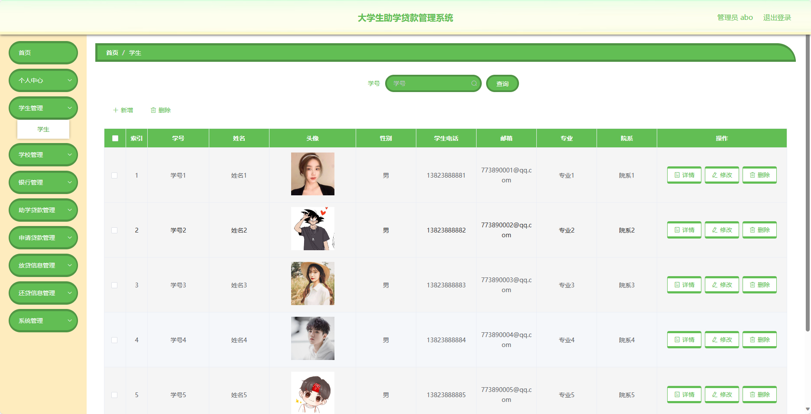
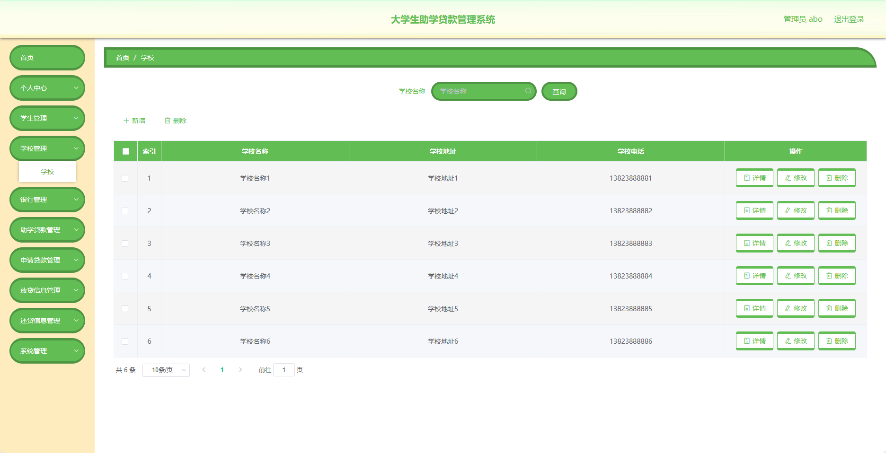
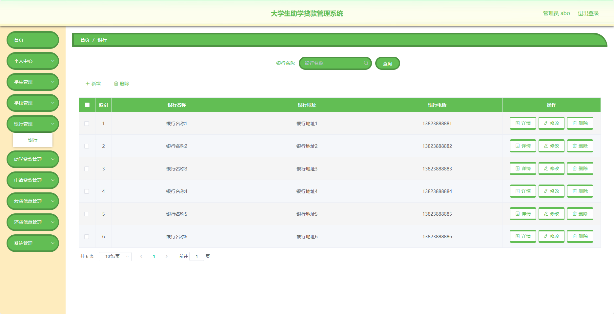
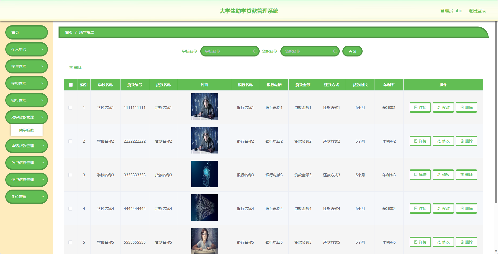
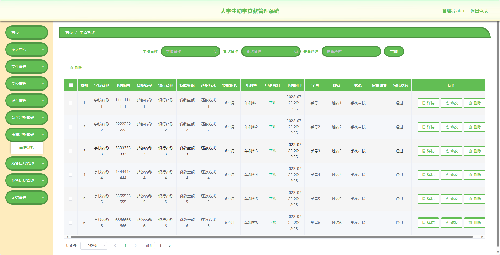
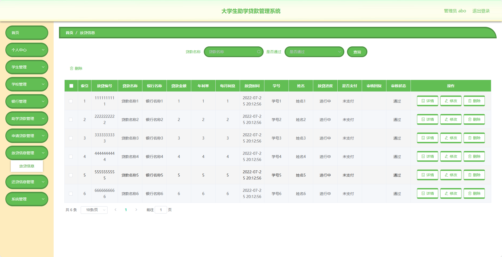
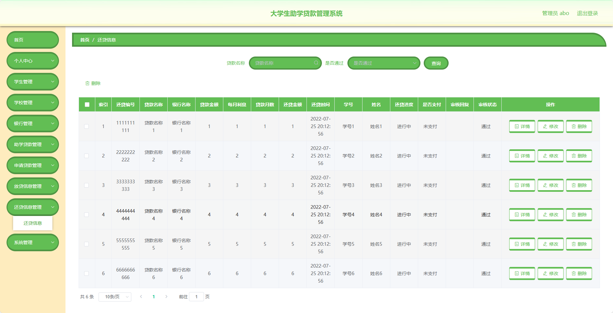
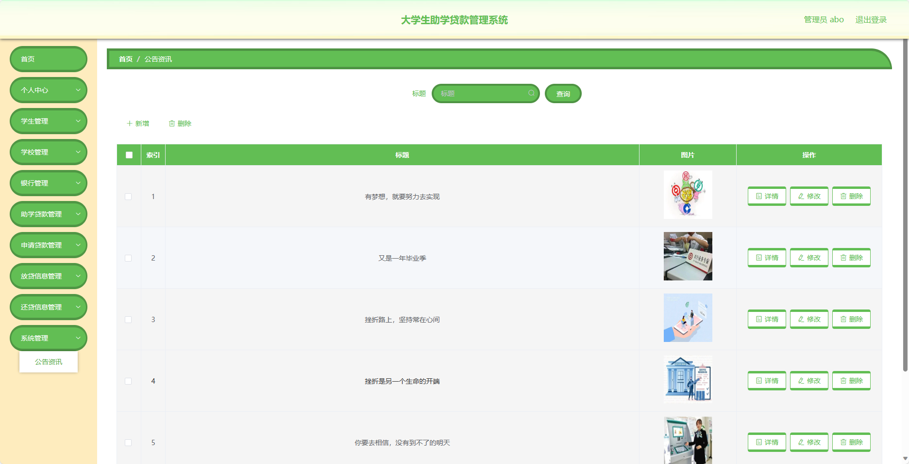
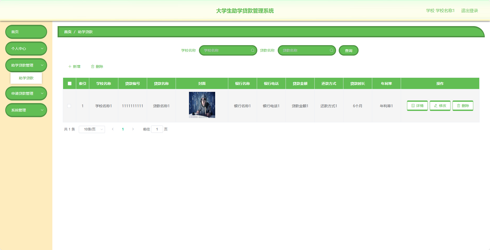

基于SpringBoot的大学生助学贷款管理系统（程序+论文）
=
- 完整代码获取地址：从戎源码网 ([https://armycodes.com/](https://armycodes.com/))
- 作者微信：19941326836  QQ：952045282 
- 承接计算机毕业设计、Java毕业设计、Python毕业设计、深度学习、机器学习
- 选题+开题报告+任务书+程序定制+安装调试+论文+答辩ppt 一条龙服务
- 所有选题地址https://github.com/nature924/allProject

一、项目介绍
---
基于Spring Boot框架实现的大学生助学贷款管理系统，系统包含两种角色：管理员、用户,系统分为前台和后台两大模块，主要功能如下。
### 前台功能：

1. 个人中心：管理员、学校、学生和银行可以在个人中心查看和管理个人信息。
2. 学生管理：管理员可以管理学生信息，包括添加、编辑、删除等操作。
3. 学校管理：管理员可以管理学校信息，包括添加、编辑、删除等操作。
4. 银行管理：管理员可以管理银行信息，包括添加、编辑、删除等操作。
5. 助学贷款管理：学校和银行可以管理助学贷款信息，包括添加、编辑、删除等操作。
6. 申请贷款管理：学生可以在此进行贷款申请。
7. 放贷信息管理：学校和银行可以管理已放贷的信息。
8. 还贷信息管理：学生可以管理还贷信息。
9. 系统管理：管理员可以管理系统的基础数据和配置。

### 后台功能：

### 管理员：

1. 个人中心：管理员可以管理个人信息。
2. 学生管理：管理员可以管理学生信息，包括添加、编辑、删除等操作。
3. 学校管理：管理员可以管理学校信息，包括添加、编辑、删除等操作。
4. 银行管理：管理员可以管理银行信息，包括添加、编辑、删除等操作。
5. 助学贷款管理：管理员可以管理助学贷款信息，包括添加、编辑、删除等操作。
6. 申请贷款管理：管理员可以查看和管理贷款申请，包括审批、驳回等操作。
7. 放贷信息管理：管理员可以管理已放贷的信息，包括添加、编辑、删除等操作。
8. 还贷信息管理：管理员可以管理还贷信息，包括添加、编辑、删除等操作。
9. 系统管理：管理员可以管理系统的基础数据和配置，包括用户信息、权限管理等。

### 学校：

1. 个人中心：学校可以管理个人信息。
2. 助学贷款管理：学校可以管理助学贷款的信息，包括添加、编辑、删除等操作。
3. 申请贷款管理：学校可以查看和管理贷款申请，包括审批、驳回等操作。
4. 系统管理：学校可以管理系统的基础数据和配置，包括用户信息、权限管理等。

### 学生：

1. 个人中心：学生可以管理个人信息。
2. 助学贷款管理：学生可以查看助学贷款的信息。
3. 申请贷款管理：学生可以进行贷款申请，包括填写申请信息等操作。
4. 放贷信息管理：学生可以查看已放贷的信息。
5. 还贷信息管理：学生可以管理还贷信息，包括填写还贷金额、还贷时间等操作。
6. 系统管理：学生可以管理个人密码等信息。

### 银行：

1. 个人中心：银行可以管理个人信息。
2. 助学贷款管理：银行可以管理助学贷款的信息，包括添加、编辑、删除等操作。
3. 申请贷款管理：银行可以查看和管理贷款申请，包括审批、驳回等操作。
4. 放贷信息管理：银行可以管理已放贷的信息，包括添加、编辑、删除等操作。
5. 还贷信息管理：银行可以管理还贷信息，包括添加、编辑、删除等操作。
6. 系统管理：银行可以管理系统的基础数据和配置，包括用户信息、权限管理等。

二、项目技术
---
- 编程语言：Java
- 数据库：MySQL
- 项目管理工具：Maven
- 前端技术：VUE、HTML、Jquery、Bootstrap
- 后端技术：Spring、SpringMVC、MyBatis

三、运行环境
---
- 操作系统：Windows、macOS都可以
- JDK版本：JDK1.8以上都可以
- 开发工具：IDEA、Ecplise、Myecplise都可以
- 数据库: MySQL5.7以上都可以
- Tomcat：任意版本都可以
- Maven：任意版本都可以

四、运行截图
---
### 论文截图：

### 程序截图：

